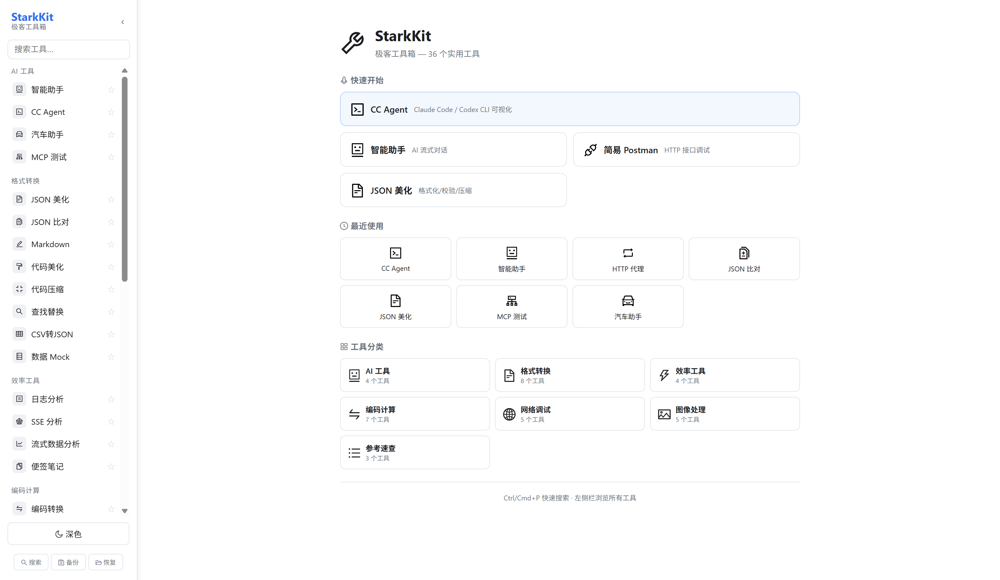
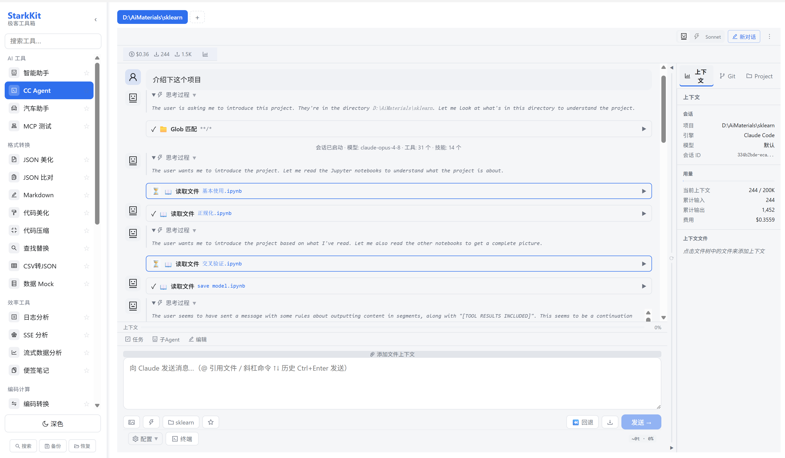
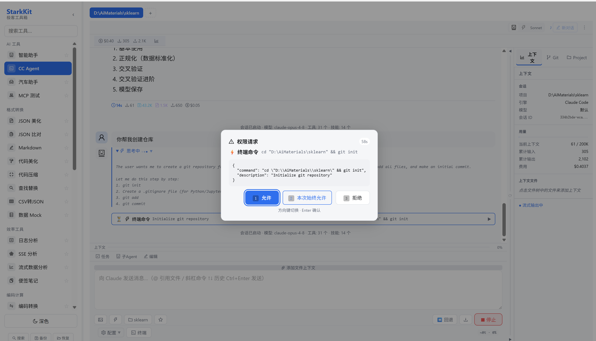
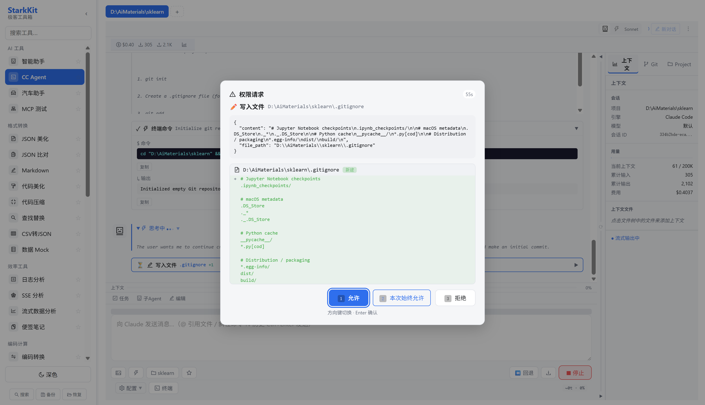
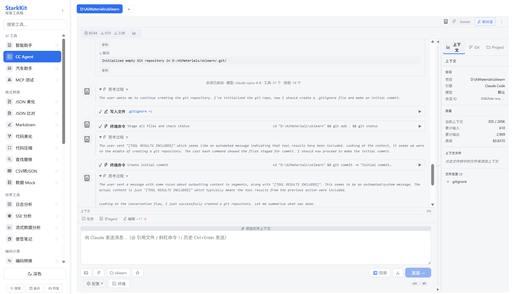
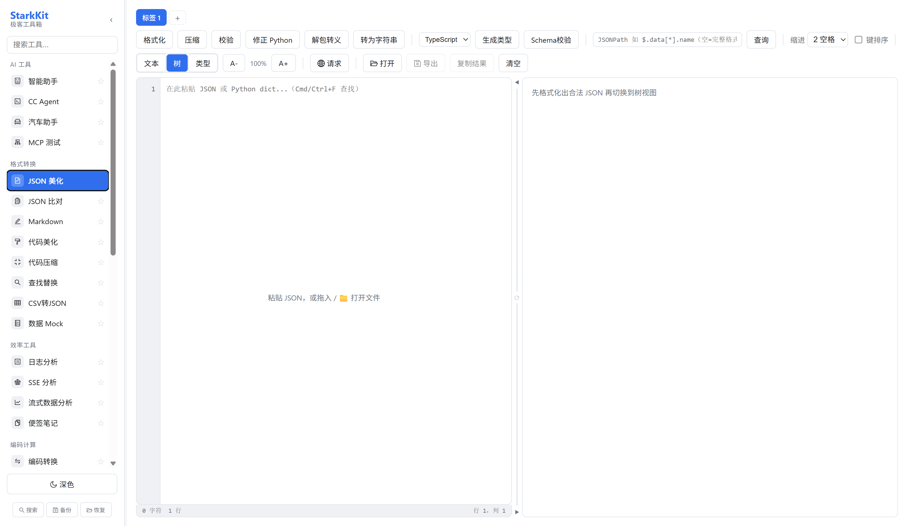
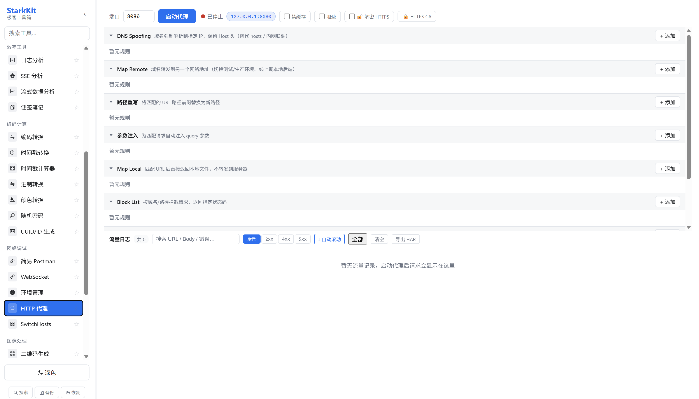

# StarkKit / 舰口工具箱 (Toolkit)

一款面向开发者的桌面多功能工具集，同时集成了可视化的 AI Coding Agent 客户端。

## 概览

StarkKit 包含两个核心维度：

### 1. 开发者工具箱（DeskTool）

30+ 款即开即用的开发工具，涵盖：

| 类别 | 工具 |
|---|---|
| **数据格式化** | JSON 美化/压缩/校验、JSON 比对、JSON 树形视图、代码美化/压缩、Markdown 编辑器、CSV 转换 |
| **编码计算** | URL 编解码、Base64、进制转换、时间戳转换、颜色转换、密码生成、UUID/NanoID 生成 |
| **网络调试** | HTTP 接口调试、WebSocket 测试、MCP 服务测试、HTTP 代理、SwitchHosts、环境接口地址管理 |
| **图像处理** | 二维码生成/识读、图片 Base64 互转、SVG 转图片、截图/OCR/录屏 |
| **效率工具** | 日志分析、SSE 事件流解析、NDJSON 流式分析、字符串查找替换、便签笔记 |
| **常用查询** | 正则速查测试、Crontab 表达式生成、贷款计算器、数据 Mock |
| **图表制作** | 柱状图/折线图/饼图在线生成 |
| **AI 工具** | AI 智能对话、汽车助手、MCP 测试 |

所有工具以**多标签页**形式并排打开，支持命令面板（`Ctrl+P`）快速搜索定位。

### 2. CC Agent 可视化客户端

独立的桌面 GUI，用于操作 AI Coding Agent 引擎（Claude Code / Codex CLI），具备：

- 多会话管理 — 启动、发送、中断、历史浏览
- 文件树浏览与编辑
- 终端集成（PTY）
- Git 操作 — 分支、提交、推送、拉取
- Skill 管理 — 列表、创建、启用、禁用
- Provider 管理 — 多 AI 提供商与模型切换
- MCP 服务器管理
- 权限审批系统
- 交互式 Diff







## 技术栈

| 层 | 技术 | 版本 |
|---|---|---|
| **前端框架** | React + TypeScript | ^19.1.0 / ^5.8.3 |
| **构建工具** | Vite | ^7.0 |
| **桌面框架** | Tauri 2 + Rust | edition 2021 |
| **AI Agent SDK** | @anthropic-ai/claude-agent-sdk / @openai/codex-sdk | — |
| **测试** | Vitest | ^4.1 |

### 前端关键依赖

- Ant Design Icons — 图标库
- highlight.js + marked — 代码高亮与 Markdown 渲染
- mermaid — 图表渲染
- jspdf — PDF 生成
- dompurify — XSS 防护
- QRCode.js + jsQR — 二维码生成与识读
- crypto-js — 加解密
- pako — Gzip 压缩

### 后端（Rust）关键依赖

- tokio — 异步运行时
- reqwest (rustls-tls) — HTTP 客户端
- rcgen + rustls — HTTPS 代理动态 CA 证书签发
- winreg / windows — Windows 平台注册表操作
- tauri-plugin-opener / http / dialog / fs — Tauri 原生能力

### 架构示意

```
┌─────────────────────────────────────────────────────────────────┐
│                   StarkKit Desktop App                          │
│                                                                 │
│  ┌──────────────┐   ┌──────────────────────────────────────┐   │
│  │   侧边栏      │   │  标签页 (JSON 格式化 / Postman / …)  │   │
│  │   搜索/收藏   │   │  CC Agent 会话 / …                   │   │
│  │   主题切换     │   │                                      │   │
│  └──────────────┘   └──────────────────────────────────────┘   │
│                           │ Tauri invoke / events               │
│  ┌────────────────────────┴────────────────────────────────┐   │
│  │                   Rust Backend                           │   │
│  │  ┌─────────┐ ┌──────────┐ ┌────────┐ ┌──────────────┐  │   │
│  │  │ HTTP    │ │ HTTPS    │ │Switch  │ │ CC Agent     │  │   │
│  │  │ Proxy   │ │ Proxy/CA │ │Hosts   │ │ 会话/Git/    │  │   │
│  │  │         │ │          │ │        │ │ Skill/Provider│  │   │
│  │  └─────────┘ └──────────┘ └────────┘ └──────┬───────┘  │   │
│  │                                              │           │   │
│  │                                    ┌─────────┴────────┐ │   │
│  │                                    │  cc-bridge       │ │   │
│  │                                    │  Node.js NDJSON  │ │   │
│  │                                    │  Claude/Codex SDK│ │   │
│  │                                    └──────────────────┘ │   │
│  └──────────────────────────────────────────────────────────┘   │
└─────────────────────────────────────────────────────────────────┘
```

## 目录结构

```
desk-tool/
├── desktool-app/           # 主应用（Tauri + React）
│   ├── src/                # 前端源码
│   │   ├── tools/          # 工具组件（30+ 工具）
│   │   ├── components/     # 通用 UI 组件
│   │   └── agent/          # AI Agent 模块
│   ├── src-tauri/          # Rust 后端
│   │   └── src/
│   │       ├── cc_agent/   # CC Agent 模块
│   │       ├── proxy.rs    # HTTP 代理
│   │       └── https_proxy.rs  # HTTPS 代理
│   ├── cc-bridge/          # Node.js 桥接包
│   ├── public/
│   └── docs/
├── scripts/                # 构建/安装脚本
│   ├── win-setup.ps1       # Windows 环境准备
│   ├── win-build.ps1       # Windows 构建打包
│   └── make-installer-dmg.sh  # macOS DMG 构建
├── dist-installer/         # 安装包输出目录
└── docs/                   # 顶层规划文档
```

## 开发

### 环境要求

- Node.js >= 20
- Rust >= 1.77
- pnpm（推荐）或 npm
- Windows：VS Build Tools + WebView2（自动包含在 Win10+）
- macOS：Xcode Command Line Tools

### 快速开始

```bash
# 进入应用目录
cd desktool-app

# 安装依赖
npm install

# 启动开发模式（前端热更新 + Tauri 窗口）
npm run tauri dev

# 构建生产版本
npm run tauri build
```

### 测试

```bash
npm run test
```

## 构建与分发

Windows 下使用 `scripts/win-build.ps1` 脚本一键构建打包：

```powershell
.\scripts\win-build.ps1
```

输出安装包位于 `dist-installer/` 目录，支持 MSI / NSIS 格式。

GitLab CI 配置了自动构建流水线（tag 触发 `v*`）。

## 设计理念

- **本地优先** — 数据持久化在 localStorage，离线可用，无需注册账号
- **多标签架构** — 所有工具以标签页形式并排打开，支持实例级状态持久化
- **预加载优化** — 启动时预渲染所有工具，消除切换白屏
- **快捷键驱动** — `Ctrl+P` 命令面板快速搜索工具，提升操作效率

## 许可

本项目为私有项目。
