<div align="center">

# 🧠 DeskTool

**手把手教你从零构建 AI Agent 桌面应用的开源项目**

让你「看别人代码学 AI Agent 开发」不再纸上谈兵

[](LICENSE)
[](https://tauri.app)
[](https://react.dev)
[](https://www.rust-lang.org)

</div>

---

## 🔥 这项目为什么值得你 star？

> **别光看 AI Agent 的论文和教程了，这里有一份完整的、可运行的、生产级的源码。**

市面上讲 Agent 的文章很多，但大多停留在「原理图 + 伪代码」。DeskTool 不一样——它是一个**完整的、已落地的桌面 Agent 应用**，代码全量开源。你想知道的 Agent 开发细节，这里都有：

| 你想学什么 | 在哪看 |
|-----------|--------|
| Agent Loop（思考→工具→再思考的循环） | `src/agent/agentLoop.ts`（263 行，清晰注释） |
| Function Calling 的 OpenAI / Claude 双协议适配 | `src/agent/agentLoop.ts` 的 `buildRequestBody`、`callOnce` |
| 工具注册表设计（Tool Registry Pattern） | `src/agent/toolRegistry.ts` — 本地工具 + MCP 工具统一调度 |
| 8 个零 API Key 的免费本地工具（搜索/搜图/网页提取/剪贴板等） | `src/agent/localTools.ts`（429 行，含 Bing/Baidu/神马解析器） |
| 子代理系统（Sub-agent Delegation Pattern） | `src/agent/subagent.ts` — 主 Agent 自动委派子代理 |
| MCP 协议客户端实现 | `src/agent/toolRegistry.ts` 的 `fetchMcpTools` + `tools/call` |
| 汽车 AI 助手（懂车帝/易车/太平洋参配查询） | `src/agent/carSpec.ts` + `src/tools/CarAssistant.tsx` |
| Rust 后端的 Agent 权限审批流 | `src-tauri/src/cc_agent/permission/` |
| Tauri 2 + React 19 + Rust 的全栈架构 | 整个项目就是答案 |

这不是 Demo，这是**可用于日常开发的工具集合**——除了 Agent，还内置了 40+ 高频开发工具（JSON 比对、HTTP 调试、正则测试、二维码、时间戳、密码生成……），全部离线运行。

---

## 🤖 AI Agent 架构全景

下面这张图展示了 DeskTool 的 Agent 系统是如何工作的——从用户输入到 AI 回复，中间经历了什么：

```mermaid
graph TB
    subgraph User["👤 用户"]
        Input["输入问题 / 下达任务"]
    end

    subgraph Frontend["🎨 前端层 · React 19 + TypeScript"]
        UI["工具面板\n40+ 开发工具"]
        CA["CarAssistant\n汽车 AI 助手"]
        CC["CC Agent\nClaude Code/Codex CLI 可视化代理"]

        subgraph AgentModule["🧩 Agent 核心模块"]
            AL["agentLoop.ts\nAgent 主循环\n思考→决策→执行→再思考"]
            TR["toolRegistry.ts\n工具注册中心\n本地+Mcp 统一管理"]
            LT["localTools.ts\n8 个免费本地工具\n搜索/搜图/网页/剪贴板/计算/QR码"]
            SA["subagent.ts\n子代理系统\n委派专业代理执行子任务"]
        end
    end

    subgraph RustBackend["🦀 Rust 后端层 (Tauri Commands)"]
        PM["permission/\n权限审批流\n每次文件/命令操作需确认"]
        SS["session/\nSession 管理\n持久化与历史"]
        NET["network/\n网络层\nHTTP 代理/请求"]
        ST["settings/\n设置持久化"]
        SK["skill/\n技能管理"]
        AC["action/\n动作执行"]
        BR["bridge/\nNode.js 桥接管理"]
    end

    subgraph Bridge["🌉 CC Bridge · Node.js 子进程"]
        BM["bridge.mjs\nNDJSON 协议桥"]
        CSDK["@anthropic-ai/\nclaude-agent-sdk"]
        OS["OpenAI Codex SDK"]
    end

    subgraph External["☁️ AI 服务（需 API Key）"]
        Claude["Claude API\n(Anthropic)"]
        OpenAI["OpenAI API\nCodex / GPT"]
        Custom["自定义 API\n兼容端点"]
        MCP["MCP 服务器\n工具扩展"]
    end

    subgraph CarData["🚗 汽车数据源（免费抓取）"]
        DCD["懂车帝\n参配数据"]
        YC["易车网\n参配数据"]
        TPY["太平洋汽车\n参配数据"]
    end

    Input --> UI
    Input --> CA
    Input --> CC

    CC --> AL
    CA --> AL

    AL --> |"1. 构建请求"| TR
    TR --> |"2. 获取工具列表"| LT
    TR --> |"2b. 加载 MCP 工具"| MCP

    AL --> |"3. 调用 LLM"| CSDK
    AL --> |"3b. 调用 LLM"| OS

    CSDK --> Claude
    OS --> OpenAI

    AL --> |"4. 执行工具"| LT
    AL --> |"4b. 委派子任务"| SA
    LT --> CA

    CA --> CarData

    AL --> |"5. 权限检查"| PM
    AL --> |"6. Session 记录"| SS

    CSDK -.-> |"MCP tools/list"| MCP
    CSDK -.-> |"MCP tools/call"| MCP

    style AgentModule fill:#1a1a2e,stroke:#e94560,stroke-width:2px
    style AL fill:#16213e,stroke:#0f3460,stroke-width:2px
    style LT fill:#16213e,stroke:#0f3460,stroke-width:2px
    style CarData fill:#2d1b00,stroke:#e67e22,stroke-width:2px
```



**数据流简述：**

```
用户输入 → Agent Loop 启动 → 调用 LLM（Claude/OpenAI）
  → LLM 返回工具调用 → 执行本地工具 / 调用 MCP 工具 / 委派子代理
  → 工具结果送回 LLM → LLM 生成最终回答 → 流式输出到 UI
```

每一轮工具调用都经过权限审批，每一步都可视化。

---

## ✨ 核心亮点

### 🧠 完整可学的 Agent 框架

这是**项目的灵魂**。`src/agent/` 目录下 6 个文件构成了一个完整、可扩展的 Agent 框架：

- **agentLoop.ts** — 核心循环引擎：思考→工具调用→再思考，支持 OpenAI 和 Claude 双协议，支持流式/非流式
- **toolRegistry.ts** — 工具注册中心：本地工具和 MCP 工具统一注册、统一调度，支持名称去重和优先级覆盖
- **localTools.ts** — 8 个零成本本地工具：搜索引擎（Bing/Baidu/神马）、搜图、网页提取、数学计算、剪贴板读写、当前时间、二维码生成，全部无需 API Key
- **subagent.ts** — 子代理系统：主 Agent 可以委派任务给「搜索研究员」「二手车鉴定师」「保险计算器」等专业子代理
- **types.ts** — 清晰完整的基础类型定义，开箱即用

### 🚗 汽车 AI 助手（行业特色）

这是一个**端到端的垂直领域 Agent** 范例：

- 内置 5 种 Agent 模式：选车顾问、二手车鉴定、保养专家、保险计算、新能源对比
- 集成三大汽车数据源：懂车帝、易车网、太平洋汽车，实时爬取参配数据
- Agent 自动判断用户意图，调用搜索 + 参数查询 + 计算等工具，给出专业建议
- 支持 Claude / OpenAI / 自定义 API 多 Provider 切换
- 支持 MCP 扩展，可挂载任何 MCP 服务器

如果你想做一个垂直领域的 AI Agent（比如房产、医疗、法律），CarAssistant 就是最好的参考样板。

### 🧰 40+ 开发者工具，全部离线运行

| 分类 | 工具 |
|------|------|
| **数据格式** | JSON 美化、JSON 比对、CSV 转换、Markdown 预览 |
| **代码处理** | 代码美化（Prettier）、代码压缩（Terser）、查找替换 |
| **编码转换** | Base64、URL Encode/Decode、Unicode、进制转换、颜色转换 |
| **网络工具** | HTTP 客户端（Postman 平替）、WebSocket 测试、HTTP 代理、环境管理、SwitchHosts |
| **AI 工具** | AI 对话（多 Provider）、CC Agent（Claude Code GUI）、汽车助手、MCP 测试器 |
| **实用工具** | 时间戳转换、时间计算器、UUID/NanoID 生成、密码生成、二维码、截图 OCR |
| **分析工具** | 日志分析、SSE 分析、流式数据(NDJSON)分析、正则测试 |
| **参考工具** | Crontab 解析、贷款计算、数据 Mock、图表制作 |

### 🔐 安全与隐私

- 所有 API Key 本地存储，不经过任何第三方服务器
- 每次 Agent 的写入/执行操作需用户显式审批（Permission 系统）
- 零遥测，不收集使用数据

---

## 📊 与同类项目对比

| 特性 | DeskTool | Claude Code (CLI) | OpenAI Codex CLI | 其他工具箱 |
|------|----------|------------------|-----------------|-----------|
| **有 GUI 界面** | ✅ React 19 桌面应用 | ❌ 纯终端 | ❌ 纯终端 | ✅ |
| **双 AI 引擎** | ✅ Claude + OpenAI | ❌ 仅 Claude | ❌ 仅 OpenAI | ❌ |
| **MCP 协议支持** | ✅ 内置 | ✅ | ❌ | ❌ |
| **工具调用可视化** | ✅ 每一步都可见 | ❌ 终端日志 | ❌ 终端日志 | ❌ |
| **权限审批 UI** | ✅ 弹窗确认 | ✅ | ❌ | ❌ |
| **子代理系统** | ✅ 内置 | ❌ | ❌ | ❌ |
| **免费搜索工具** | ✅ 零 API Key | ❌ | ❌ | ❌ |
| **离线工具** | ✅ 40+ 全部离线 | ❌ | ❌ | ✅ |
| **安装包大小** | < 10MB (Tauri) | npm 包 | npm 包 | 200MB+ (Electron) |
| **开源代码可学习** | ✅ 全量中文注释 | ❌ | 部分 | 部分 |

---

## 🏗️ 项目结构（学习路线图）

想学 Agent 开发？按这个顺序读代码：

```
toolkit/
├── desktool-app/
│   ├── src/
│   │   ├── agent/                    ← 🥇 从这里开始！Agent 核心
│   │   │   ├── types.ts              ← 类型定义，先看懂数据流动
│   │   │   ├── localTools.ts         ← 本地工具实现（8 个免费工具）
│   │   │   ├── toolRegistry.ts       ← 工具注册中心（本地 + MCP）
│   │   │   ├── agentLoop.ts          ← Agent 主循环（灵魂代码）
│   │   │   └── subagent.ts           ← 子代理系统
│   │   ├── tools/
│   │   │   ├── CarAssistant.tsx      ← 🥈 垂直领域 Agent 实例
│   │   │   ├── CcAgent.tsx           ← 🥉 CC Agent 可视化界面
│   │   │   ├── AiChat.tsx            ← AI 对话界面
│   │   │   ├── registry.ts           ← 40+ 工具注册
│   │   │   ├── JsonFormatter.tsx     ← 参考：单个工具的实现
│   │   │   ├── HttpClient.tsx        ← 参考：复杂工具的实现
│   │   │   └── ...
│   │   ├── App.tsx                   ← 应用主入口，多标签 + 侧边栏
│   │   └── components/               ← 共享 UI 组件
│   ├── src-tauri/
│   │   └── src/
│   │       ├── cc_agent/             ← Rust 后端 Agent 模块
│   │       │   ├── session/          ← Session 管理
│   │       │   ├── permission/       ← 权限审批
│   │       │   ├── bridge/           ← Node.js 桥接
│   │       │   ├── handler/          ← Handler 注册中心 + 命令
│   │       │   ├── model.rs          ← 数据模型
│   │       │   └── ...
│   │       ├── lib.rs                ← 所有 Tauri Command 注册
│   │       └── proxy.rs              ← HTTP 代理
│   └── cc-bridge/                    ← Node.js 桥接进程
│       ├── bridge.mjs                ← NDJSON 协议桥
│       └── codex/                    ← OpenAI Codex 适配
├── scripts/                          ← 构建脚本
└── docs/                             ← 设计文档
```

---

## 🚀 快速开始

### 环境要求

- [Node.js](https://nodejs.org) 18+
- [Rust](https://www.rust-lang.org/tools/install) stable 工具链
- 平台依赖见 [Tauri 前置要求](https://tauri.app/start/prerequisites/)

### 开发模式

```bash
cd desktool-app

# 安装前端依赖
npm install

# 安装 cc-bridge 依赖
cd cc-bridge && npm install && cd ..

# 启动开发环境（Vite + Tauri 窗口）
npm run tauri dev
```

### 构建安装包

```bash
cd desktool-app
npm run tauri build
# 产物在 src-tauri/target/release/bundle/
```

### 运行测试

```bash
cd desktool-app && npm run test
# Vitest: 当前 182 测试全绿
# Rust: cargo test --lib 138 passed
```

---

## 🧪 当前状态

| 维度 | 数据 |
|------|------|
| Rust 后端代码 | 12,414 行（93 个源文件） |
| 前端代码 | 33,104 行 |
| Rust 测试 | 138 个 ✅ |
| 前端测试 | 182 个 ✅ |
| 国际化 | 728 个 i18n key（中/英双语）|

---

## 🤝 如何参与 / 学习建议

**如果你想学 AI Agent 开发：**

1. 先读 `src/agent/types.ts` 了解数据模型
2. 再读 `src/agent/agentLoop.ts` 理解 Agent 循环
3. 然后读 `src/agent/toolRegistry.ts` 看工具如何注册和调度
4. 接着读 `src/agent/localTools.ts` 看如何实现工具
5. 最后读 `src/agent/subagent.ts` 看子代理系统
6. 打开 `CarAssistant.tsx` 看完整应用集成

**如果你想贡献代码：**

- 提交 Issue / PR 前确保 `npm run build` + `npm run test` + `cargo test` 通过
- 欢迎加新工具、新 Agent 模式、新子代理
- 欢迎翻译、文档、测试贡献

---

## 📄 License

[MIT](LICENSE) © DeskTool Contributors

---

<div align="center">

**如果这个项目对你有帮助，请给个 ⭐ — 这是对开源最大的鼓励**

想学 AI Agent 开发？关注这个项目就够了。代码是最好的教程。

</div>
